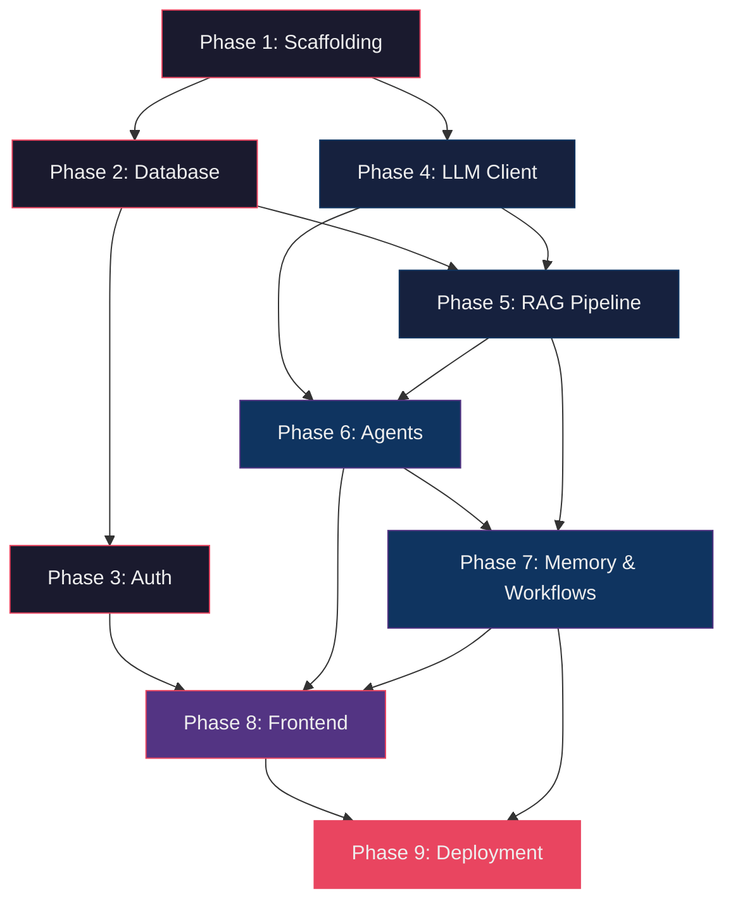

# AI Workspace OS — Implementation Roadmap

---

## Phase 1: Project Scaffolding & Configuration

**Objective**: Establish project skeleton, dependency management, configuration system, and Docker infrastructure. Everything after this phase builds on top of a working `uv` environment with importable packages.

**Dependencies**: None (root phase)

### Required Files

| File | Purpose |
|---|---|
| `backend/pyproject.toml` | uv project — all Python deps declared here |
| `backend/app/__init__.py` | Package init |
| `backend/app/config.py` | `pydantic-settings` config with env var loading |
| `backend/app/core/__init__.py` | Core package init |
| `backend/app/core/exceptions.py` | Custom exception hierarchy (`AppError`, `NotFoundError`, `AuthError`, `ValidationError`) |
| `backend/app/core/schemas/__init__.py` | Shared schemas package |
| `backend/app/core/schemas/common.py` | `APIResponse[T]`, `PaginatedResponse`, `ErrorDetail` |
| `backend/app/core/schemas/enums.py` | `UserRole`, `DocumentStatus`, `WorkflowStatus`, `AgentType`, `MessageRole` |
| `docker-compose.yml` | PostgreSQL, Redis, ChromaDB services |
| `docker-compose.dev.yml` | Dev overrides (ports, volumes) |
| `.env.example` | All required env vars with placeholder values |

### Acceptance Criteria

- [ ] `uv sync` installs all dependencies without errors
- [ ] `from app.config import settings` loads settings from `.env`
- [ ] `docker compose up -d` starts PostgreSQL, Redis, ChromaDB
- [ ] All enums and shared schemas importable
- [ ] Custom exceptions have `status_code` and `detail` attributes

### Testing Strategy

- **Unit**: Import tests — every module imports cleanly
- **Unit**: `settings` loads defaults, overrides from env vars
- **Unit**: Enum membership tests
- **No integration tests yet**

---

## Phase 2: Database Layer

**Objective**: Set up async SQLAlchemy, Alembic migrations, base ORM model with mixins, and a generic CRUD repository. After this phase, any new model only needs to define columns and inherit mixins.

**Dependencies**: Phase 1

### Required Files

| File | Purpose |
|---|---|
| `backend/app/db/__init__.py` | DB package |
| `backend/app/db/session.py` | `AsyncEngine`, `async_sessionmaker`, `get_db()` dependency |
| `backend/app/models/__init__.py` | Models package + `__all__` export |
| `backend/app/models/base.py` | `Base`, `UUIDMixin`, `TimestampMixin` |
| `backend/app/models/user.py` | `User` ORM model |
| `backend/app/repositories/__init__.py` | Repos package |
| `backend/app/repositories/base.py` | `BaseRepository[T]` — generic async CRUD |
| `backend/app/repositories/user_repo.py` | `UserRepository` with `get_by_email()` |
| `backend/alembic.ini` | Alembic config |
| `backend/app/db/migrations/env.py` | Alembic env with async engine |
| `backend/app/db/migrations/versions/` | Migration versions directory |

### Key Design Decisions

- `UUIDMixin`: Generates `uuid4` PKs server-side (not DB-generated) for predictable IDs
- `TimestampMixin`: `created_at` (server_default), `updated_at` (onupdate)
- `BaseRepository[T]`: Generic with `get`, `get_multi`, `create`, `update`, `delete` — accepts Pydantic schemas
- Session management: `get_db()` yields `AsyncSession`, auto-commits on success, rolls back on exception

### Acceptance Criteria

- [ ] `alembic upgrade head` creates `users` table in PostgreSQL
- [ ] `UserRepository.create()` persists a user and returns it
- [ ] `UserRepository.get_by_email()` returns `None` for missing users
- [ ] `BaseRepository` works with any model inheriting `Base`
- [ ] All DB operations are async

### Testing Strategy

- **Unit**: `BaseRepository` CRUD against in-memory SQLite async (swap engine in conftest)
- **Integration**: `UserRepository` against real PostgreSQL (docker-compose)
- **Fixture**: `conftest.py` with `db_session` fixture using transaction rollback

---

## Phase 3: Authentication

**Objective**: Complete JWT auth flow — signup, login, refresh, `current_user` dependency. After this phase, any endpoint can be protected with `Depends(get_current_user)`.

**Dependencies**: Phase 2

### Required Files

| File | Purpose |
|---|---|
| `backend/app/core/security.py` | `hash_password()`, `verify_password()`, `create_access_token()`, `create_refresh_token()`, `decode_token()` |
| `backend/app/core/dependencies.py` | `get_current_user`, `get_current_admin`, `require_roles()` |
| `backend/app/services/__init__.py` | Services package |
| `backend/app/services/auth_service.py` | `signup()`, `login()`, `refresh()` — orchestrates repo + security |
| `backend/app/api/__init__.py` | API package |
| `backend/app/api/router.py` | Root `APIRouter` aggregating all v1 routers |
| `backend/app/api/v1/__init__.py` | V1 package |
| `backend/app/api/v1/auth.py` | Auth endpoints |
| `backend/app/api/v1/health.py` | `GET /health` (DB, Redis, ChromaDB connectivity) |
| `backend/app/core/middleware.py` | CORS, request logging, rate limiting (Redis) |
| `backend/app/core/events.py` | Startup/shutdown hooks (DB pool, Redis connect) |
| `backend/app/main.py` | FastAPI app factory |

### Pydantic Schemas (in respective endpoint files or `core/schemas/`)

- `SignupRequest(email, password, full_name)`
- `LoginRequest(email, password)`
- `TokenResponse(access_token, refresh_token, token_type)`
- `UserResponse(id, email, full_name, role, created_at)`

### Acceptance Criteria

- [ ] `POST /api/v1/auth/signup` creates user, returns tokens
- [ ] `POST /api/v1/auth/login` validates credentials, returns tokens
- [ ] `POST /api/v1/auth/refresh` rotates tokens
- [ ] `GET /api/v1/auth/me` returns user profile (protected)
- [ ] Invalid/expired tokens return 401
- [ ] Duplicate email returns 409
- [ ] Rate limiter blocks after threshold (e.g., 60 req/min)
- [ ] `GET /api/v1/health` returns `{"status": "ok", "db": true, "redis": true}`
- [ ] App starts with `uvicorn app.main:app`

### Testing Strategy

- **Unit**: `security.py` — token creation/decode, password hash/verify
- **Unit**: `auth_service.py` — mock repository, test signup/login logic
- **Integration**: Full auth flow against running app (TestClient + real DB)
- **Negative**: Expired token, wrong password, missing fields

---

## Phase 4: AI Abstraction Layer

**Objective**: Create a thin, testable LLM client abstraction over Groq. Supports sync/async, streaming, retries, and model selection. This is the single integration point for all LLM calls — agents never call Groq directly.

**Dependencies**: Phase 1 (config only — no DB or auth needed)

### Required Files

| File | Purpose |
|---|---|
| `backend/app/services/llm_client.py` | `LLMClient` — async Groq wrapper with streaming, retry, model selection |

### Interface Design

```python
class LLMClient:
    async def complete(messages, model, temperature, max_tokens) -> str
    async def stream(messages, model, temperature, max_tokens) -> AsyncIterator[str]
    async def complete_with_tools(messages, tools, model) -> ToolCallResult
```

### Key Design Decisions

- **Single class, no inheritance hierarchy** — avoid premature abstraction. If a second LLM provider is needed later, introduce a Protocol then.
- **Retry with exponential backoff**: 3 retries, handles Groq rate limits (429) and transient errors (500/503)
- **Model enum**: `GroqModel.LLAMA_70B`, `GroqModel.DEEPSEEK_R1` — validated at call site
- **Token counting**: Return `usage` dict from every call for observability
- **Streaming**: Yields string chunks via `async for`

### Acceptance Criteria

- [ ] `LLMClient.complete()` returns a string response from Groq
- [ ] `LLMClient.stream()` yields tokens one by one
- [ ] `LLMClient.complete_with_tools()` returns parsed tool calls
- [ ] Retries on 429/500, raises after 3 failures
- [ ] Works with both `llama-3.3-70b-versatile` and `deepseek-r1-distill-llama-70b`
- [ ] Token usage tracked in return value

### Testing Strategy

- **Unit**: Mock `httpx.AsyncClient` — test retry logic, error handling, streaming parse
- **Integration**: One live Groq call (gated behind env flag `RUN_LLM_TESTS=1`)
- **Unit**: Model enum validation rejects unknown models

---

## Phase 5: RAG Pipeline

**Objective**: Complete document ingestion → chunking → embedding → storage → retrieval pipeline. After this phase, documents can be uploaded and queried via semantic search.

**Dependencies**: Phase 2 (DB), Phase 4 (LLM client for optional reranking)

### Module 5A: Document Parsing

| File | Purpose |
|---|---|
| `backend/app/rag/__init__.py` | RAG package |
| `backend/app/rag/ingestion.py` | `parse_pdf()`, `parse_docx()`, `parse_txt()` → raw text |

- **Libraries**: `pypdf`, `python-docx`
- **Pure functions**, no side effects — input bytes, output string
- **Independently testable** with fixture files

### Module 5B: Chunking

| File | Purpose |
|---|---|
| `backend/app/rag/chunking.py` | `RecursiveChunker(chunk_size, overlap)` → `list[Chunk]` |

- `Chunk = namedtuple('Chunk', ['content', 'index', 'metadata'])`
- Splits by paragraph → sentence → character with configurable size/overlap
- Metadata tracks source document, page number, character offsets

### Module 5C: Embeddings & Vector Store

| File | Purpose |
|---|---|
| `backend/app/rag/embeddings.py` | `EmbeddingService.embed(texts) -> list[list[float]]` |
| `backend/app/rag/vector_store.py` | `VectorStore` — ChromaDB adapter (add, query, delete by metadata) |

- Embedding model: `all-MiniLM-L6-v2` via `sentence-transformers`
- `VectorStore` wraps ChromaDB client with typed methods
- Collections: `document_chunks`, `user_memories`, `semantic_cache`

### Module 5D: Retrieval

| File | Purpose |
|---|---|
| `backend/app/rag/retriever.py` | `HybridRetriever.retrieve(query, user_id, top_k) -> list[RetrievedChunk]` |

- **Dense retrieval**: Embed query → ChromaDB similarity search
- **Keyword retrieval**: PostgreSQL full-text search on `document_chunks.content`
- **Reciprocal Rank Fusion**: Merge dense + keyword results
- Returns `RetrievedChunk(content, score, document_id, chunk_index, metadata)`

### Module 5E: Document API + Background Ingestion

| File | Purpose |
|---|---|
| `backend/app/models/document.py` | `Document`, `DocumentChunk` ORM models |
| `backend/app/repositories/document_repo.py` | Document + chunk CRUD |
| `backend/app/services/document_service.py` | Upload handling, status tracking |
| `backend/app/workers/__init__.py` | Workers package |
| `backend/app/workers/celery_app.py` | Celery config (broker=Redis) |
| `backend/app/workers/ingestion_tasks.py` | `ingest_document.delay(document_id)` |
| `backend/app/api/v1/documents.py` | Upload, list, query endpoints |

### Acceptance Criteria

- [ ] PDF/DOCX/TXT files parse to clean text
- [ ] Chunker produces overlapping chunks of configurable size
- [ ] Embeddings generate 384-dim vectors
- [ ] `VectorStore.add()` stores chunks, `VectorStore.query()` returns ranked results
- [ ] `HybridRetriever` combines dense + keyword results
- [ ] `POST /api/v1/documents/upload` returns 202, triggers background ingestion
- [ ] Document status transitions: `pending → processing → ready`
- [ ] `POST /api/v1/documents/{id}/query` returns relevant chunks with scores
- [ ] Alembic migration creates `documents` + `document_chunks` tables

### Testing Strategy

- **Unit (5A)**: Parse fixture files (small PDF, DOCX, TXT), assert non-empty output
- **Unit (5B)**: Chunk known text, assert chunk count, overlap correctness, metadata
- **Unit (5C)**: Embed a sentence, assert vector dimensions = 384
- **Unit (5D)**: Mock vector store + DB, test fusion logic
- **Integration (5E)**: Upload file → wait for ingestion → query → get relevant results
- **Fixture files**: Create `tests/fixtures/sample.pdf`, `sample.docx`, `sample.txt`

---

## Phase 6: Agent System

**Objective**: Build the LangGraph orchestrator and specialist agents. After this phase, chat messages are routed to the appropriate agent which uses tools and RAG to generate responses.

**Dependencies**: Phase 4 (LLM client), Phase 5 (RAG retriever)

### Module 6A: Agent Foundation

| File | Purpose |
|---|---|
| `backend/app/agents/__init__.py` | Agents package |
| `backend/app/agents/base_agent.py` | `BaseAgent` Protocol — `async def run(state) -> AgentState` |
| `backend/app/agents/prompts/` | System prompt templates (plain `.txt` files) |

- `BaseAgent` is a **Protocol**, not ABC — no forced inheritance
- Each agent implements `run(state: AgentState) -> AgentState`
- Prompts loaded from files at startup, cached in memory

### Module 6B: Orchestrator

| File | Purpose |
|---|---|
| `backend/app/agents/orchestrator.py` | LangGraph `StateGraph` — classify → retrieve → route → execute → synthesize |

- **Intent classifier**: Single LLM call with constrained output → `AgentType` enum
- **Conditional routing**: LangGraph edges based on classified intent
- **State**: `AgentState(TypedDict)` — messages, context, memory, citations, tool_results
- **Fallback**: If classification confidence is low, route to direct LLM (no agent)

### Module 6C: Research Agent

| File | Purpose |
|---|---|
| `backend/app/agents/research_agent.py` | RAG-powered Q&A agent |
| `backend/app/agents/tools/search_tools.py` | `semantic_search`, `keyword_search` LangChain tools |

### Module 6D: Code Agent

| File | Purpose |
|---|---|
| `backend/app/agents/code_agent.py` | Code analysis + PR review agent |
| `backend/app/agents/tools/code_tools.py` | `analyze_diff`, `explain_code`, `detect_issues` tools |

### Module 6E: Planning Agent

| File | Purpose |
|---|---|
| `backend/app/agents/planning_agent.py` | Task decomposition agent |

### Module 6F: Chat Integration

| File | Purpose |
|---|---|
| `backend/app/models/conversation.py` | `Conversation`, `Message` ORM models |
| `backend/app/repositories/conversation_repo.py` | Conversation + message CRUD |
| `backend/app/services/chat_service.py` | Orchestrates: persist message → invoke orchestrator → stream response → persist reply |
| `backend/app/api/v1/chat.py` | Chat endpoints with SSE streaming |

### Acceptance Criteria

- [x] Intent classifier correctly routes: knowledge queries → Research, code questions → Code, task breakdowns → Planning
- [x] Research agent retrieves RAG context, generates cited answers
- [x] Code agent analyzes diffs, returns structured review
- [x] Planning agent decomposes tasks into subtask lists
- [x] Chat endpoint streams tokens via SSE
- [x] Conversation and messages persisted in PostgreSQL
- [x] Tool calls visible in streaming events

### Testing Strategy

- **Unit (6A)**: Agent protocol compliance — each agent has `run()` method
- **Unit (6B)**: Mock LLM → test classifier returns correct `AgentType`
- **Unit (6C-E)**: Mock LLM + mock tools → test agent produces expected state mutations
- **Integration (6F)**: Send chat message → assert SSE stream contains tokens + done event
- **Integration**: Full flow — upload doc → chat about it → get cited answer

---

## Phase 7: Memory & Async Workflows

**Objective**: Add persistent memory across sessions and workflow automation with chained agent execution.

**Dependencies**: Phase 6 (agents), Phase 5 (vector store)

### Module 7A: Memory System

| File | Purpose |
|---|---|
| `backend/app/memory/__init__.py` | Memory package |
| `backend/app/memory/short_term.py` | `ShortTermMemory` — Redis session buffer |
| `backend/app/memory/long_term.py` | `LongTermMemory` — PostgreSQL + ChromaDB |
| `backend/app/memory/manager.py` | `MemoryManager` — unified read/write interface |
| `backend/app/models/memory.py` | `Memory` ORM model |
| `backend/app/repositories/memory_repo.py` | Memory CRUD |
| `backend/app/agents/memory_agent.py` | Agent that decides what to remember/recall |

- `ShortTermMemory`: Last N messages + active context, keyed by `session:{user_id}:{conv_id}`, TTL 2h
- `LongTermMemory`: Facts, preferences, insights stored as embeddings for semantic recall
- `MemoryManager.recall(query, user_id)` → searches both STM and LTM, returns merged context

### Module 7B: Workflow Engine

| File | Purpose |
|---|---|
| `backend/app/models/workflow.py` | `Workflow`, `WorkflowStep` ORM models |
| `backend/app/repositories/workflow_repo.py` | Workflow + step CRUD |
| `backend/app/services/workflow_service.py` | Create, validate, execute workflows |
| `backend/app/workers/workflow_tasks.py` | `execute_workflow.delay(workflow_id)` — runs steps sequentially |
| `backend/app/agents/automation_agent.py` | Executes individual workflow steps via tools |
| `backend/app/agents/tools/workflow_tools.py` | `execute_step`, `chain_output` tools |
| `backend/app/api/v1/workflows.py` | Workflow CRUD + execution endpoints |
| `backend/app/rag/cache.py` | Semantic cache — Redis + embedding similarity |

### Acceptance Criteria

- [ ] Short-term memory persists across messages in same conversation
- [ ] Long-term memory persists across conversations (new conversation recalls past facts)
- [ ] Memory agent stores important findings automatically
- [ ] Workflow with 3 chained steps executes in background
- [ ] Step output feeds as input to next step
- [ ] Failed step marks workflow as `failed` with error in `execution_log`
- [ ] Semantic cache avoids duplicate LLM calls for similar queries
- [ ] `GET /api/v1/workflows/{id}` shows real-time step progress

### Testing Strategy

- **Unit (7A)**: `MemoryManager.recall()` with mocked STM + LTM
- **Unit (7A)**: Memory importance scoring logic
- **Unit (7B)**: Workflow DAG validation (cycle detection, missing deps)
- **Integration (7A)**: Store memory → new conversation → recall returns it
- **Integration (7B)**: Create workflow → execute → poll status until complete → verify outputs
- **Unit**: Semantic cache hit/miss with known embeddings

---

## Phase 8: Frontend

**Objective**: Build the Next.js 15 frontend with all pages, SSE streaming chat, and file management.

**Dependencies**: Phase 3 (auth API), Phase 5 (document API), Phase 6 (chat API), Phase 7 (workflow API)

### Module 8A: Scaffolding & Auth

| File | Purpose |
|---|---|
| `frontend/package.json` | Next.js 15 + TypeScript + TailwindCSS + shadcn/ui |
| `frontend/src/lib/api.ts` | Fetch wrapper with JWT injection, refresh logic |
| `frontend/src/lib/auth.ts` | Token storage, auth context provider |
| `frontend/src/types/index.ts` | Shared TypeScript interfaces (User, Conversation, Document, etc.) |
| `frontend/src/app/layout.tsx` | Root layout (dark theme, fonts, providers) |
| `frontend/src/app/(auth)/login/page.tsx` | Login page |
| `frontend/src/app/(auth)/signup/page.tsx` | Signup page |
| `frontend/src/components/layout/` | Sidebar, header, navigation |

### Module 8B: Core Pages

| File | Purpose |
|---|---|
| `frontend/src/app/page.tsx` | Landing page |
| `frontend/src/app/dashboard/page.tsx` | Dashboard (stats, recent conversations, documents) |
| `frontend/src/app/settings/page.tsx` | User settings + preferences |

### Module 8C: AI Workspace

| File | Purpose |
|---|---|
| `frontend/src/app/workspace/page.tsx` | Chat interface (Client Component) |
| `frontend/src/components/chat/ChatWindow.tsx` | Message list + streaming display |
| `frontend/src/components/chat/MessageBubble.tsx` | Individual message (markdown, citations) |
| `frontend/src/components/chat/ChatInput.tsx` | Input with file attachment |
| `frontend/src/lib/hooks/useChat.ts` | SSE streaming hook |

### Module 8D: Documents & Workflows

| File | Purpose |
|---|---|
| `frontend/src/app/documents/page.tsx` | File upload + list + status |
| `frontend/src/components/documents/UploadZone.tsx` | Drag-and-drop upload |
| `frontend/src/app/workflows/page.tsx` | Workflow builder + execution monitor |
| `frontend/src/app/repositories/page.tsx` | Repo analysis submission + results |

### Acceptance Criteria

- [ ] Signup → login → redirect to dashboard
- [ ] JWT refresh works transparently
- [ ] Chat sends message → streams tokens in real-time → renders markdown
- [ ] Citations display as clickable references
- [ ] File upload shows progress → status updates (pending → ready)
- [ ] Workflow builder creates multi-step workflow → executes → shows progress
- [ ] All pages responsive, dark mode, glassmorphism aesthetic
- [ ] Sidebar navigation with active state

### Testing Strategy

- **Manual**: Visual QA on all pages (dark mode, responsive breakpoints)
- **Integration**: Playwright E2E — signup → login → upload doc → chat about doc → get answer
- **Unit**: `useChat` hook with mocked EventSource

---

## Phase 9: Deployment & Production Hardening

**Objective**: Docker production setup, CI/CD, observability, documentation.

**Dependencies**: All previous phases

### Required Files

| File | Purpose |
|---|---|
| `backend/Dockerfile` | Multi-stage Python build (builder + runtime) |
| `frontend/Dockerfile` | Next.js standalone build |
| `docker-compose.yml` | Production stack (all services) |
| `.github/workflows/ci.yml` | Lint, type-check, test on PR |
| `.github/workflows/deploy.yml` | Build + push Docker images |
| `README.md` | Setup instructions, architecture overview, API docs link |
| `docs/architecture.md` | System architecture (generated from blueprint) |
| `docs/api.md` | API reference |

### Module 9A: Repository Intelligence (deferred to here)

| File | Purpose |
|---|---|
| `backend/app/services/repo_service.py` | Git clone, file tree, diff parsing |
| `backend/app/workers/repo_tasks.py` | Background repo analysis |
| `backend/app/api/v1/repositories.py` | Repo analysis + PR review endpoints |

### Module 9B: Production Config

- **Dockerfile (backend)**: `python:3.12-slim`, non-root user, `uv sync --frozen`, `gunicorn` + `uvicorn` workers
- **Dockerfile (frontend)**: `node:20-alpine`, `next build` standalone output
- **Health checks**: Docker `HEALTHCHECK` + `/api/v1/health`
- **Structured logging**: JSON format via `structlog`
- **Environment validation**: App refuses to start if required env vars are missing

### Acceptance Criteria

- [ ] `docker compose up` starts entire stack (backend, frontend, postgres, redis, chromadb, celery worker)
- [ ] Health check passes on all services
- [ ] CI pipeline runs lint + tests on PR
- [ ] README has complete setup instructions (clone → env → docker compose up → working app)
- [ ] Non-root containers, no secrets in images
- [ ] Structured JSON logs in production mode
- [ ] `.env.example` documents every env var

### Testing Strategy

- **Smoke**: `docker compose up` → hit `/api/v1/health` → 200 OK
- **E2E**: Full user journey in containerized environment
- **CI**: Automated on every PR

---

## Dependency Graph



> [!TIP]
> **Phases 1+4 can run in parallel** — the LLM client has no DB dependency. Similarly, **Phase 3 and Phase 5 can run in parallel** after Phase 2 completes.

---

## File Count Summary

| Phase | New Files | Cumulative |
|---|---|---|
| 1 — Scaffolding | 11 | 11 |
| 2 — Database | 10 | 21 |
| 3 — Auth | 10 | 31 |
| 4 — LLM Client | 1 | 32 |
| 5 — RAG Pipeline | 12 | 44 |
| 6 — Agents | 13 | 57 |
| 7 — Memory & Workflows | 12 | 69 |
| 8 — Frontend | ~20 | 89 |
| 9 — Deployment | ~10 | 99 |

> [!IMPORTANT]
> Each phase is designed to be **committable and independently runnable**. Never generate files from a future phase — each phase should pass its own acceptance criteria before proceeding.
